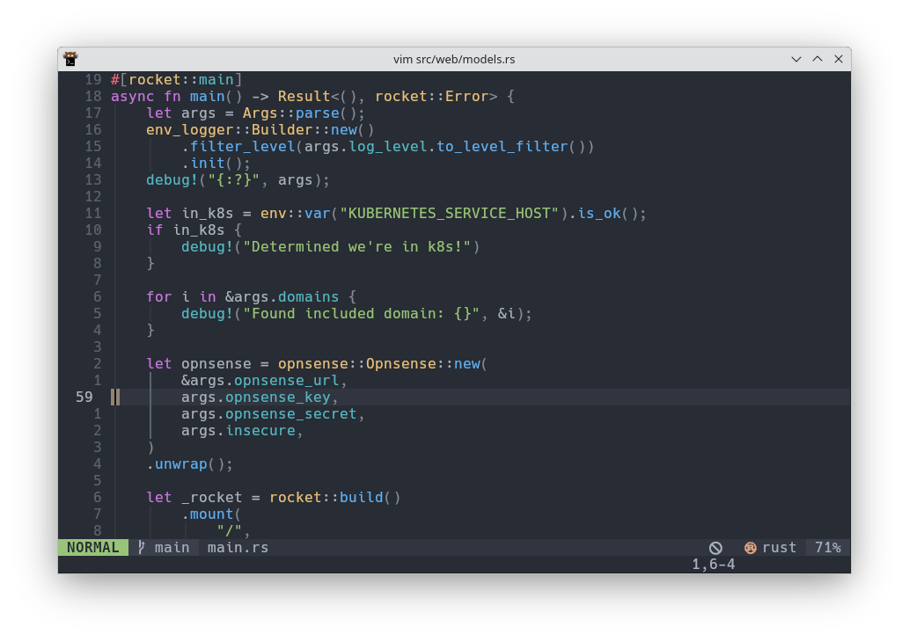

# Dotfiles

> User-specific application configuration is traditionally stored in so called
> dotfiles (files whose filename starts with a dot). It is common practice to
> track dotfiles with a version control system such as Git to keep track of
> changes and synchronize dotfiles across various hosts. There are various
> approaches to managing your dotfiles (e.g. directly tracking dotfiles in the
> home directory v.s. storing them in a subdirectory and
> symlinking/copying/generating files with a shell script or a dedicated tool).

\- Arch Wiki

 

This is a series of scripts and configurations pertaining to my environment.

## Setup

1.  Clone this repo to your home directory.

2.  Edit `.gitconfig` and `.gitconfig-work` to fit your needs.

    > By default, this file points to my own personal GitHub details. Most other
    > scripts utilize these variables.

3.  Install all the required dependencies with:

        ./install.sh

    > Hopefully distro agnostic :)

4.  Symbolic link all the dotfiles and clone any remaining plugins using:

        ./setup.sh

    > All the vim plugins should automatically be installed with Vim-Plug. Note:
    > this symbolic links ALL relevant files in this repository. Ensure you edit
    > `.gitconfig` to change your identity.

5.  Install fonts with:

        ./fonts.sh

## Editor

Vim, Emacs, and VSCode.

Vim for most everything, (Doom)Emacs for org mode, and VSCode for the rare times
I need to edit on windows. My vim setup is optimized for Python, C/C++,
Javascript, and general configuration files. All, of course, detailed in the
[vimrc](/.vimrc).

When I have to use VSCode, the plugins are tracked by this [settings sync
plugin](https://marketplace.visualstudio.com/items?itemName=Shan.code-settings-sync),
all my configuration are stored on this
[gist](https://gist.github.com/jarulsamy/a1a11a59eeadf0b429b1c357c4d51238).

## i3

I Primarily use i3 as my WM on my desktop machines usually alongside Arch or
Fedora.

Most of my configuration files follow the XDG configuration scheme, and
therefore are in `~/.config`.

By default, all the necessary config files should be symbolically linked.
However, **not all dependencies are installed by default.** This is by design,
as these same scripts are often used on headless servers.

Stuff not installed by `install.sh`

- alacritty
- dmenu
- feh
- i3-gaps
- mpc
- mpd
- ncmpcpp
- networkmanager_dmenu
- polybar
- pulseaudio-alsa
- ranger
- rofi
- xorg-server
- xorg-xauth
- xorg-xbacklight
- xorg-xrandr

If you use Arch like me most of the dependencies are in the mainline repos:

    sudo pacman -S alacritty dmenu feh i3-gaps mpc mpd ncmpcpp pulseaudio-alsa ranger rofi xorg-server xorg-xauth xorg-xbacklight xorg-xrandr

The rest can be installed from the AUR with your favorite AUR helper:

    yay -S polybar networkmanager-dmenu

Thanks to @adi1090x for the [polybar
themes](https://github.com/adi1090x/polybar-themes).

## Keybinds

Here are a few of the custom keybinds I implemented.

| Keybind  | Action                        |
| :------: | :---------------------------- |
| `ctrl-s` | Adds sudo to start of line    |
| `ctrl-k` | `cd ..`                       |
| `ctrl-q` | Kill all other tmux sessions. |

## ZSH Functions

I am actively developing a handful of convience scripts that I use daily. I'm
extremely lazy and hate typing long commands.

[clone](zfunc/clone) - Shortens github clone commands.

> For example, `git clone git@github.com:jarulsamy/example` becomes `clone example`

[gh-ssh](zfunc/gh-ssh) - Automatically generates and adds a SSH key to the SSH
agent and copies to clipboard. Helpful for setting up new systems.

[pypacks](zfunc/pypacks) - Auto install every python package that I normally
need on a day-to-day basis.

[ghw](zfunc/ghw) - Shorthand way to open (most) git repositories in the default
web browser.

> For example `firefox https://github.com/jarulsamy/.dotfiles` becomes `ghw .dotfiles`.

## Autocompletion

Autocompletion for the aforementioned zsh functions is powered by a homebrew
project called [dotEngine](https://github.com/jarulsamy/dotEngine).
