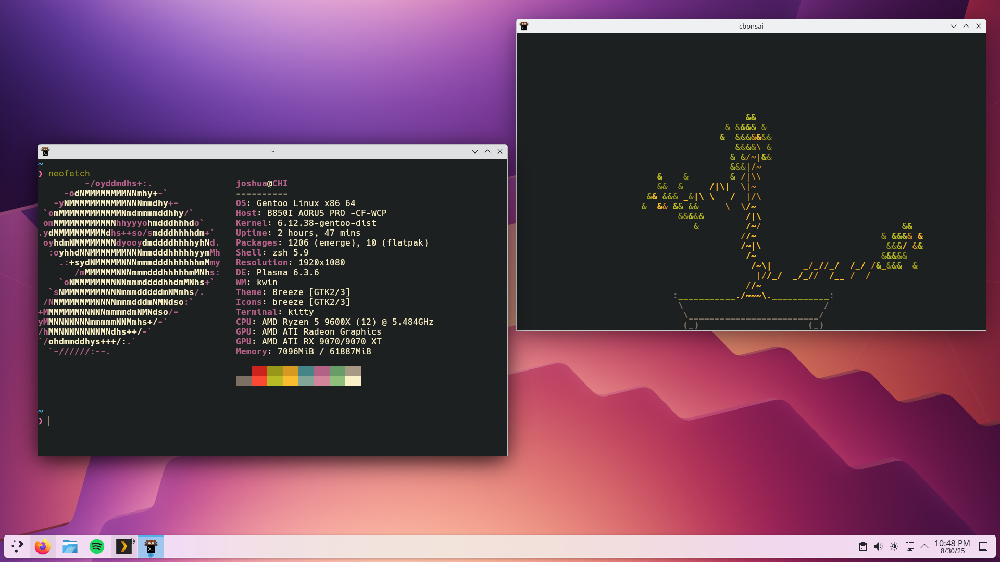

# Dotfiles

> User-specific application configuration is traditionally stored in so called dotfiles (files whose filename starts with a dot). It is common practice to track dotfiles with a version control system such as Git to keep track of changes and synchronize dotfiles across various hosts. There are various approaches to managing your dotfiles (e.g. directly tracking dotfiles in the home directory v.s. storing them in a subdirectory and symlinking/copying/generating files with a shell script or a dedicated tool).

\- Arch Wiki

This is a series of scripts and configurations pertaining to my environment.

## Setup

1. Clone this repo to your home directory.

2. Edit `config.ini` and `.gitconfig` to fit your needs.

    > By default, both these files point to my own personal github details.
    > Most other scripts utilize these variables.

3. Install all the required dependencies with:

        ./install.sh

    > Hopefully distro agnostic :)

4. Symbolic link all the dotfiles using:

        ./setup.sh

    > All the vim plugins should automatically be installed with Vundle.
    > Note: this symbolic links ALL relevant files in this repository. Ensure you edit `.gitconfig` to change your identity.

5. Install fonts with:

        ./fonts.sh

## Editor

Visual Studio Code and Vim.

I use VSCode with a series of plugins. Using this [settings sync plugin](https://marketplace.visualstudio.com/items?itemName=Shan.code-settings-sync), all my configuration are stored on this [gist](https://gist.github.com/jarulsamy/a1a11a59eeadf0b429b1c357c4d51238).

My vim setup is optimized for Python, C/C++, and general unix configuration files.

This is accomplished with the following plugins:

* [IndentPython](https://github.com/vim-scripts/indentpython.vim)
* [Syntastic](https://github.com/vim-syntastic/syntastic)
* [Vim-airline](https://github.com/vim-airline/vim-airline) / [Vim-airline-themes](https://github.com/vim-airline/vim-airline-themes)
* [Nerdtree](https://github.com/preservim/nerdtree)
* [Nerdtree-git](https://github.com/Xuyuanp/nerdtree-git-plugin)
* [Black](https://github.com/psf/black)
* [Gruvbox](https://github.com/morhetz/gruvbox)
* [Wakatime](https://github.com/wakatime/vim-wakatime)
* [YouCompleteMe](https://github.com/ycm-core/YouCompleteMe)
* [vim-surround](https://github.com/tpope/vim-surround)
* [vim-pandoc](https://github.com/vim-pandoc/vim-pandoc)

All, of course, detailed in the [vimrc](/.vimrc).

## Shell

I use a heavily customized version of ZSH using oh-my-zsh to create an optimal terminal experience.

By default, my `.zshrc` auto starts tmux on remote ssh sessions.

## i3

I Primarily use i3 gaps as my WM on my desktop machines usually alongside Arch.

Most of my configuration files follow the XDG configuration scheme, and therefore are in `~/.config`.

By default, all the necessary config files should be symbolically linked. However, **not all dependencies are installed by default.** This is by design, as these same scripts are often used on  headless servers.

Stuff not installed by `install.sh`

* xorg-server
* xorg-xrandr
* xorg-xauth
* xorg-xbacklight
* i3-gaps
* alacritty
* feh
* mpc
* mpd
* ncmpcpp
* rofi
* dmenu
* ranger
* pulseaudio-alsa
* polybar
* networkmanager_dmenu

If you use Arch like me most of the dependencies are in the mainline repos:

    sudo pacman -S xorg-server xorg-xrandr xorg-xauth xorg-xbacklight i3-gaps alacritty feh mpc mpd ncmpcpp rofi dmenu ranger pulseaudio-alsa

The rest can be installed from the AUR with your favorite AUR helper:

    yay -S polybar networkmanager-dmenu

Thanks to @adi1090x for the [polybar themes](https://github.com/adi1090x/polybar-themes).

## Keybinds

Here are a few of the custom keybinds I implemented.

| Keybind  | Action                        |
| :------: | :---------------------------- |
| `ctrl-s` | Adds sudo to start of line    |
| `ctrl-k` | `cd ..`                       |
| `ctrl-q` | Kill all other tmux sessions. |

## ZSH Functions

I am actively developing a handful of convience scripts that I use daily.
I'm extremely lazy and hate typing long commands.

[clone](zfunc/clone) - Shortens github clone commands.

> For example, `git clone git@github.com:jarulsamy/example` becomes `clone example`

[gh-ssh](zfunc/gh-ssh) - Automatically generates and adds a SSH key to the SSH agent and copies to clipboard. Helpful for setting up new systems.

[reddit](zfunc/reddit) - Auto create my daily driver conda environment with commonly used tools.

> Essentially, creates python 3.7 conda environment named `reddit` with various autoformatters preinstalled.

[ghw](zfunc/ghw) - Shorthand way to open github repositories in the default web browser.

> For example `firefox https://github.com/jarulsamy/.dotfiles` becomes `ghw .dotfiles`.

## MOTD

By default, `setup.sh` should also install a custom MOTD.
> The custom MOTD is only auto-installed on Debian based distros.

The text can be customized by editing the files in [motd](/motd).

